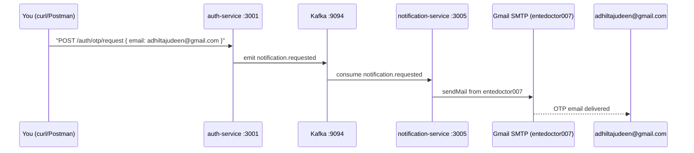

# Notification Service Smoke Test

## Sender vs Recipient

| Role | Address |
|---|---|
| SMTP sender (transporter) | `entedoctor007@gmail.com` (App Password in `.env`) |
| Test recipient (user) | `adhiltajudeen@gmail.com` |

## Flow Being Tested



## Prerequisites

- Docker Desktop running
- `.env` present at repo root (already created with Gmail credentials)
- Two terminal windows available

---

## Step 1 — Start Infrastructure

```powershell
corepack pnpm docker:up
```

Wait ~30 s for Kafka to become healthy. Verify at **http://localhost:8080** (Kafka UI) — the cluster should show `local` online.

---

## Step 2 — Populate `.env` with Auth-Service vars

The auth-service needs DB, Redis, and JWT values alongside the mail vars already in `.env`. Add these to the existing [`.env`](.env):

```dotenv
# Auth Service
AUTH_DB_HOST=localhost
AUTH_DB_PORT=5433
AUTH_DB_USER=ente_auth
AUTH_DB_PASSWORD=ente_auth_password
AUTH_DB_NAME=ente_auth

REDIS_HOST=localhost
REDIS_PORT=6379

JWT_PRIVATE_KEY=smoke-test-secret-change-in-prod
JWT_EXPIRY_SECONDS=900

KAFKA_BROKERS=localhost:9094
```

---

## Step 3 — Run the Auth DB Migration

The `auth_users` and `refresh_tokens` tables must exist before the service starts.

```powershell
# connect to the auth-postgres container and pipe the migration SQL
docker exec -i ente-auth-postgres psql -U ente_auth -d ente_auth `
  -f - < apps/auth-service/src/infrastructure/database/migrations/001_auth_schema.sql
```

Expected output: `CREATE TABLE`, `CREATE TABLE`, `CREATE INDEX`, `CREATE INDEX`.

---

## Step 4 — Start the Two Services

Open **two separate terminals** from the repo root.

**Terminal A — auth-service:**
```powershell
corepack pnpm --filter @ente-doctor/auth-service start:dev
```

Wait until you see: `[NestFactory] Starting Nest application...` and `Nest application successfully started`.

**Terminal B — notification-service:**
```powershell
corepack pnpm --filter @ente-doctor/notification-service start:dev
```

Wait until you see both:
- `Nest application successfully started` (HTTP on 3005)
- `[ClientKafka]` / consumer connected log (Kafka microservice transport ready)

---

## Step 5 — Fire the Trigger

Use curl **or** Postman.

**curl (PowerShell):**
```powershell
Invoke-RestMethod -Method Post `
  -Uri "http://localhost:3001/auth/otp/request" `
  -ContentType "application/json" `
  -Body '{"email": "adhiltajudeen@gmail.com"}'
```

**Expected HTTP response (202 Accepted):**
```json
{ "message": "OTP sent" }
```

---

## Step 6 — Verify the Email

1. Open **adhiltajudeen@gmail.com** inbox.
2. Look for subject **"Your Ente Doctor login code"** sent from `Ente Doctor <entedoctor007@gmail.com>`.
3. The email should contain a 6-digit code styled in the blue dashed box from `otp.template.ts`.

---

## Step 7 — Verify via Logs

**notification-service terminal** should print (in order):

```
[SendEmailUseCase] dispatching template="otp" to="adhiltajudeen@gmail.com"
[NodemailerAdapter] sent template="otp" to="adhiltajudeen@gmail.com" (attempt 1)
```

**Kafka UI** (`http://localhost:8080`) → Topics → `notification.requested` → Messages — you should see the event payload with `channel: "email"`.

---

## What Can Go Wrong

| Symptom | Likely Cause | Fix |
|---|---|---|
| 500 from auth-service | DB tables missing | Re-run Step 3 migration |
| notification-service never logs | Consumer group not connected | Restart notification-service; check `KAFKA_BROKERS=localhost:9094` in `.env` |
| `sendMail` error: `Invalid login` | Wrong App Password | Verify `MAIL_PASS` in `.env`; regenerate App Password in Google Account |
| Email lands in Spam | Gmail treating unknown sender | Mark as Not Spam once; add SPF/DKIM for production |
